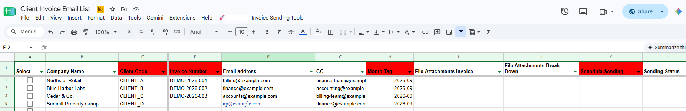
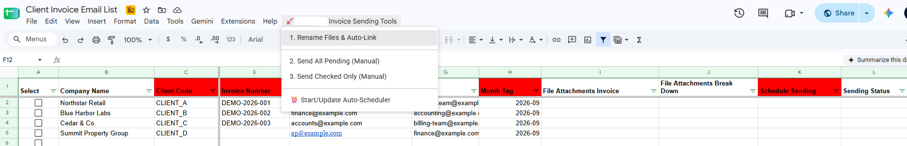
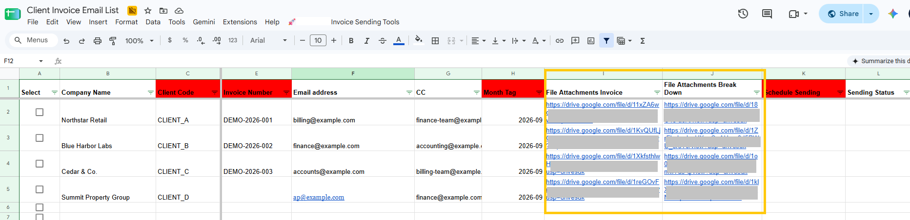
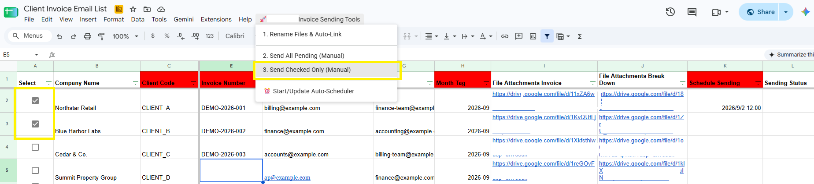
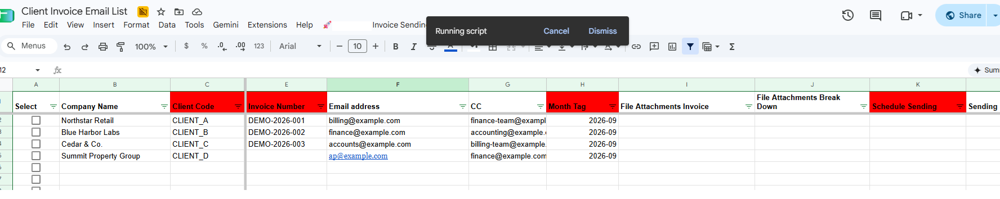
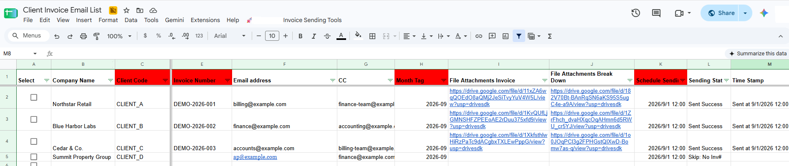
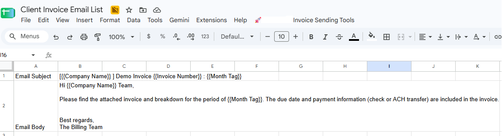

# Google Apps Script Invoice Email Automation

A Google Workspace automation project designed to streamline recurring invoice preparation and email processing using Google Apps Script, Google Sheets, Google Drive, and Gmail.

> **Portfolio Project**
>
> This repository presents an anonymized version of a workflow originally developed for a real business process. All client names, email addresses, invoice references, file identifiers, and operational data shown here are fictional or anonymized. No production client data is included.

---

## Overview

The original invoice workflow involved multiple repetitive manual steps: retrieving client billing information, matching invoice files, preparing attachments, composing emails, sending invoices, tracking completion, and organizing processed documents.

Before developing a custom solution, existing automation tools were evaluated. However, the workflow required tighter integration with an existing Google Sheets and CRM-based process, as well as more control over how and when invoices were processed.

I therefore built a custom Google Apps Script workflow using the existing spreadsheet as the operational control layer.

The solution supports:

* CRM-linked client information lookup
* invoice file renaming and automatic Google Drive linking
* reusable email templates with dynamic placeholders
* invoice and supporting-document attachments
* manual processing of all pending invoices
* manual processing of selected invoice rows
* scheduled invoice processing
* pre-send validation
* duplicate-processing prevention
* status and timestamp logging
* post-processing file archiving

---

## Business Challenge

The original process required the operator to repeatedly:

1. identify the correct client
2. retrieve billing contact information
3. locate invoice and supporting files
4. standardize file names
5. attach the correct documents
6. prepare the invoice email
7. determine which invoices should be processed
8. track completed sends
9. organize completed files

This introduced avoidable operational friction and increased the risk of:

* incorrect recipient information
* missing attachments
* inconsistent file naming
* duplicate processing
* missed scheduled invoices
* incomplete status tracking

The objective was therefore not simply to automate email sending.

The goal was to create a controlled invoice-processing workflow around the existing Google Workspace environment.

---

## Solution Architecture

```text
CRM Reference Data
        │
        ▼
Invoice Control Sheet
        │
        ├── Client information lookup
        ├── Invoice metadata
        ├── File references
        ├── Scheduled processing time
        └── Processing status
        │
        ▼
Google Apps Script
        │
        ├── Validate records
        ├── Match and rename files
        ├── Generate email content
        ├── Retrieve Drive attachments
        ├── Determine processing mode
        └── Send through GmailApp
        │
        ▼
Status Logging + File Archiving
```

The design intentionally combines automation with operator control rather than forcing every invoice through the same execution path.

---

## Workflow

### 1. CRM-Linked Invoice Preparation

The invoice control sheet is linked to a separate CRM reference sheet.

When a client code is entered, an `onEdit()` trigger searches the CRM data and automatically retrieves available client information, including:

* company name
* billing email
* CC email
* other required CRM-linked information

If the client code cannot be found, the record is flagged rather than silently continuing with incomplete information.



*CRM-linked invoice preparation using fictional portfolio records.*

---

### 2. File Rename Control

The workflow includes a spreadsheet-native custom menu so that users can execute operational functions without opening the Apps Script editor.

One available action scans a designated Google Drive folder and prepares invoice files for processing.



*The custom spreadsheet menu exposes invoice-processing functions directly to the operator.*

---

### 3. File Rename and Auto-Link

Uploaded files are matched against invoice records using either the client code or company name.

Matched files are renamed using a standardized naming convention.

Example:

```text
Northstar Retail_Invoice_09-2026.pdf
Northstar Retail_Breakdown_09-2026.pdf
```

The corresponding Google Drive URLs are then written back to the invoice control sheet automatically.



*Matched invoice and breakdown files are standardized and linked back to the corresponding invoice records.*

---

## Processing Modes

The workflow provides three processing paths.

### Send All Pending

Processes all eligible records that have not already been successfully completed.

This is designed for routine batch processing when multiple invoices are ready at the same time.

### Send Checked Only

Processes only rows selected through spreadsheet checkboxes.

This supports:

* sending a single invoice
* processing a controlled subset
* handling exceptions separately
* selectively retrying records

### Scheduled Processing

Invoice rows can include a scheduled processing time.

A time-driven Google Apps Script trigger periodically checks pending records and processes only those whose scheduled time has been reached.

The current implementation uses an hourly trigger.



*Operators can process all pending records, selected records, or enable scheduled processing directly from Google Sheets.*

---

## Script Execution

The workflow runs directly from the spreadsheet interface while the Apps Script handles the underlying validation, file access, template generation, sending logic, and status updates.



*The spreadsheet remains the operational interface while Apps Script executes the automation in the background.*

---

## Validation and Status Handling

Before processing an invoice, the script validates each record.

Checks include:

* invoice number
* recipient email
* linked invoice or supporting file
* previous successful-processing status
* scheduled processing time where applicable

Records that fail validation are skipped and assigned an actionable status.

Example statuses include:

```text
Sent Success
Skip: No Inv#
Error: No Email
Skip: No File
Error: <runtime error>
```

Successfully processed records also receive a timestamp.



*Successful records are logged while incomplete records are skipped with explicit status messages.*

This validation layer is particularly important because the workflow supports external client communication. The automation is designed to fail visibly rather than continue with incomplete invoice data.

---

## Dynamic Email Template

Email content is maintained separately from the main processing logic in an `Email_Template` sheet.

The subject and body use dynamic placeholders such as:

```text
{{Company Name}}
{{Invoice Number}}
{{Month Tag}}
```

At runtime, the script replaces these placeholders with values from the corresponding invoice record.



*Email content is maintained separately from execution logic and populated dynamically at runtime.*

Separating the template from the core script allows email copy to be maintained without modifying the underlying automation.

---

## Google Drive Attachment Handling

Invoice and supporting-document URLs are stored in the invoice control sheet.

For each linked document, the script:

1. reads the Drive URL
2. extracts the Google Drive file ID
3. retrieves the file through `DriveApp`
4. converts the file into a Blob
5. adds it to the Gmail attachment array

The current implementation supports up to two linked files per invoice record.

If file references exist but no usable attachment can be retrieved, processing is stopped instead of continuing without the intended documents.

---

## Duplicate-Processing Prevention

Successfully completed records are marked:

```text
Sent Success
```

Future manual or scheduled processing checks this status and skips records that have already been completed.

A completion timestamp is also written back to the sheet, providing lightweight operational traceability.

---

## Post-Processing File Archiving

After successful processing, related invoice files can be moved from the working folder into month-specific archive folders.

Example:

```text
Archive_2026-08
Archive_2026-09
```

If the required archive folder does not yet exist, the workflow creates it automatically.

This keeps active invoice documents separated from completed records.

---

## Spreadsheet Interface

The script adds a custom menu directly to Google Sheets.

```text
Invoice Sending Tools

1. Rename Files & Auto-Link
2. Send All Pending (Manual)
3. Send Checked Only (Manual)
4. Start/Update Auto-Scheduler
```

This allows operational users to execute the workflow without opening the Apps Script editor.

---

## Technology Stack

* Google Apps Script
* Google Sheets
* Google Drive
* Gmail
* Google Apps Script Triggers

Core Apps Script services include:

```javascript
SpreadsheetApp
DriveApp
GmailApp
ScriptApp
Utilities
```

---

## Key Implementation Patterns

### Event-Driven CRM Lookup

`onEdit()` reacts to client-code changes and retrieves matching information from the CRM reference sheet.

### Shared Row Processor

Manual and scheduled workflows use the same core row-processing logic rather than maintaining completely separate implementations.

### Time-Driven Automation

An installable trigger invokes scheduled processing periodically.

### Template-Driven Email Generation

Email copy is maintained separately from the execution code and populated using placeholders.

### File-System Integration

Google Drive is used for:

* file matching
* renaming
* URL linking
* attachment retrieval
* archiving

### Row-Level Operational Logging

Each invoice record stores its processing result and completion timestamp.

---

## Build vs. Buy Decision

Existing automation options were evaluated before developing the custom workflow.

The required process involved more than scheduled email delivery. It needed to coordinate:

* CRM-based client lookup
* an existing Google Sheets workflow
* file matching
* standardized file naming
* multiple attachments
* selective processing
* batch processing
* scheduled processing
* validation
* status tracking
* Drive archiving

Because the operating workflow already lived primarily inside Google Workspace, Apps Script provided a lightweight way to automate the process without introducing another standalone operational platform.

The guiding design principle was:

> **Automate repetitive execution while preserving human control over exceptions and processing decisions.**

---

## Outcome

The project transformed a repetitive invoice-email workflow into a structured Google Workspace process with centralized control, automated validation, and multiple processing modes.

The resulting workflow improved consistency around:

* client-data reuse
* invoice preparation
* file naming
* attachment handling
* processing status
* scheduled execution
* post-processing organization

No numerical time-saving or error-reduction claims are included because production performance data is not published in this portfolio repository.

---

## Privacy and Anonymization

This repository is intended strictly for portfolio demonstration.

The public version does **not** contain production client information.

The following information has been removed, replaced, or fictionalized:

* company and client names
* client codes
* recipient email addresses
* CC addresses
* invoice numbers
* financial information
* invoice documents
* Google Drive identifiers
* internal folder identifiers
* production email content
* other operational identifiers

Example portfolio records use fictional entities such as:

```text
CLIENT_A | Northstar Retail
CLIENT_B | Blue Harbor Labs
CLIENT_C | Cedar & Co.
CLIENT_D | Summit Property Group
```

Example email addresses use non-production domains such as:

```text
billing@example.com
finance@example.com
accounts@example.com
```

The public source code preserves the workflow architecture and implementation concepts while removing production-specific data and configuration.

---

## Repository Structure

```text
Google-Apps-Script-Invoice-Email-Automation/
│
├── README.md
│
├── src/
│   └── invoice-email-automation.gs
│
└── screenshots/
    ├── 01-crm-linked-invoice-setup.png
    ├── 02-file-rename-control.png
    ├── 03-file-auto-link-results.png
    ├── 04-selected-send-controls.png
    ├── 05-script-execution.png
    ├── 06-validation-send-results.png
    └── 07-email-template.png
```

---

## Potential Improvements

Potential future enhancements include:

* replacing numeric column indexes with named constants
* centralized configuration management
* configurable timezone handling
* stronger email-address validation
* structured execution logging
* improved retry and error-state handling
* `LockService` protection against overlapping executions
* batch spreadsheet writes for improved performance
* more explicit archive-failure reporting
* automated tests for helper functions that do not depend on Google services

These are presented as potential enhancements and are not claimed as functionality in the current implementation.

---

## Disclaimer

This project is presented for portfolio and demonstration purposes.

All screenshots, client records, names, email addresses, invoice references, and sample content are fictional or anonymized.

No production client data is included.
